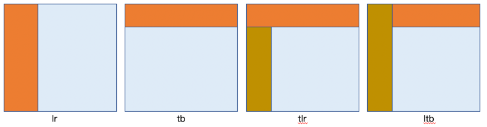

# SsLayout 主界面布局

## 组件 API

### Attributes 属性

| 参数 | 说明 | 类型 | 可选值 | 默认值 |
|  ----  | ----  | ----  | ----  | ----  |
| type | 布局类型 | String | `lr` - 左右布局 / `tb` - 上下布局 / `tlr` 上下布局（下侧分为左右布局） / `ltb` - 左右布局（右侧再上下布局）  | `lr` |
| top-height | 顶部高度 |  String | - | 48px |
| left-width | 左侧宽度 |  String | - | 200px |
| left-width-mini | 左侧收缩后宽度 |  String | - | 80px |
| is-expand | 左侧是否展开 |  Boolean | true / false | true |
| is-fixed | 头部是否固定 | Boolean | true / false | true | 

### Methods 方法

| 方法名 | 说明 | 参数 | 返回值 |
|  ----  | ----  | ----  | ----  |
|  |  |  |  |

### Events 事件

| 事件名 | 说明 | 参数 | 返回值 |
|  ----  | ----  | ----  | ----  |
|  |  |  |  |

### Slots 插槽

| 插槽名 | 说明 | 参数 |
|  ----  | ----  | ----  |
|  |  |  |
